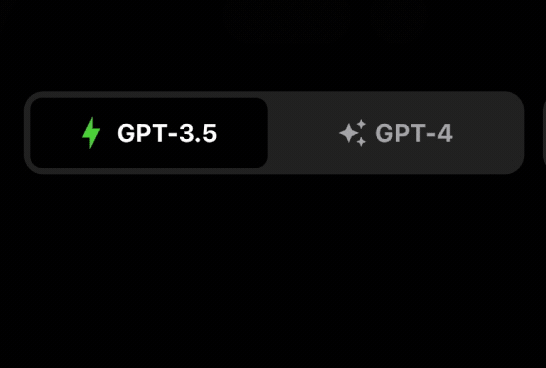

[](https://www.npmjs.com/package/@hadnet/react-native-segmented-control)
[](https://www.npmjs.com/package/@hadnet/react-native-segmented-control)
[](https://www.npmjs.com/package/@hadnet/react-native-segmented-control)
[](https://www.npmjs.com/package/@hadnet/react-native-segmented-control)


# @hadnet/react-native-segmented-control

A fully customizable iOS like segmented control component for RN CLI projects powered by Reanimated 2/3



## Installation

```sh
yarn add @hadnet/react-native-segmented-control
```

### Dependencies

```
react-native-haptic-feedback react-native-reanimated
```

## Usage

```tsx
import SegmentedControl, {Segment} from "@hadnet/react-native-segmented-control";

export default function App() {
  return (
    <View style={styles.container}>
      <SegmentedControl
        haptics
        containerMargin={16}
        segmentedControlWrapper={{
          backgroundColor: '#1e1e1e',
          width: 300,
          borderRadius: 12,
        }}
        tileStyle={{
          margin: 4,
          backgroundColor: 'black',
          // paddingVertical: 18
          // borderRadius: 12,
        }}
        segments={[
          <Segment
            title="GPT-3.5"
            inactiveTitleStyle={{color: '#9a999f'}}
            activeTitleStyle={{color: 'white'}}
            activeIconColor={'limegreen'}
            icon={
              // Accepts react-native-vector-icons
              <MaterialCommunityIcons name="lightning-bolt" size={22} />
            }
          />,
          <Segment
            title="GPT-4"
            inactiveTitleStyle={{color: '#9a999f'}}
            activeTitleStyle={{color: 'white'}}
            activeIconColor={'#9978f2'}
            icon={<MaterialIcons name="auto-awesome" size={18} />}
          />,
        ]}
        // badgeValues={[null, 2]}
        onChange={index => setTabIndex(index)}
        currentIndex={tabIndex}
      />
    </View>
  )
}
```

## Contributing

See the [contributing guide](CONTRIBUTING.md) to learn how to contribute to the repository and the development workflow.

## License

MIT

---


